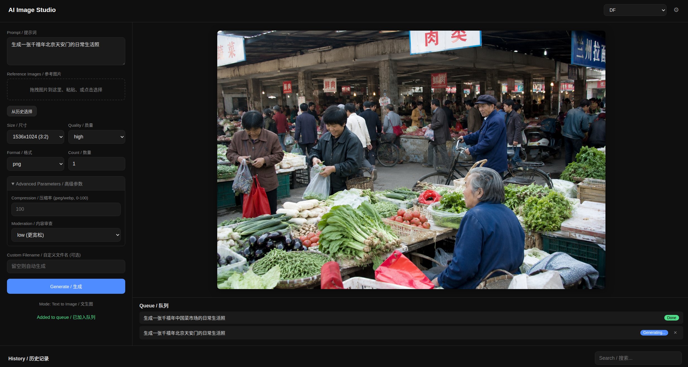
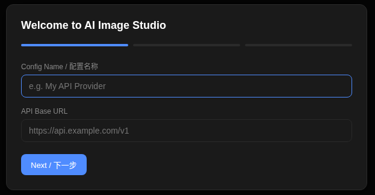
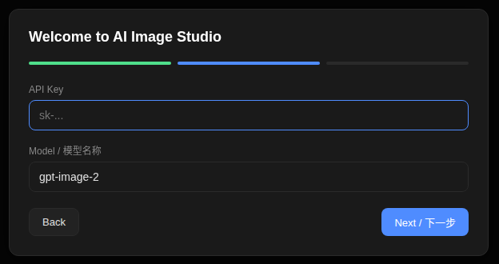
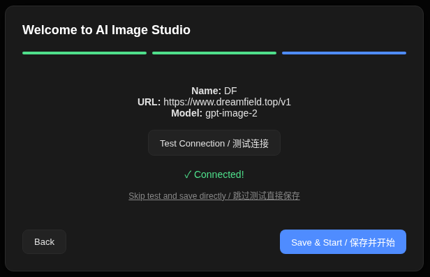

<!--
╔══════════════════════════════════════════════════════════════════════╗
║  DreamSeed 种梦计划 — AI创造者大赛  官方 README 模板                ║
║                                                                      ║
║  使用说明：                                                          ║
║  1. 将本模板放在参赛仓库根目录 README.md 的顶部                       ║
║  2. 头图使用 DreamField 官方公开活动图片地址                         ║
║  3. 请保留 DREAMFIELD_README_HEADER_START / END 标识                 ║
║  4. 分割线以下供创作者自由编写项目内容                               ║
╚══════════════════════════════════════════════════════════════════════╝
-->

<!-- DREAMFIELD_README_HEADER_START -->

<p align="center">
  <a href="https://www.dreamfield.top">
    
  </a>
</p>

<!-- DREAMFIELD_README_HEADER_END -->

# AI Image Studio

> 买了 gpt-image-2 中转 API 不知道怎么调用？启动即用，填入配置就能生图。
>
> A local web UI for image generation APIs — just plug in your API key and start creating.
>
> 推荐使用 [DreamField 中转站](https://www.dreamfield.top/) 获取 API 服务，**gpt-image-2 价格低至 ¥0.04/次**。

[简体中文](#简体中文) | [English](#english) | [繁體中文](#繁體中文)

---

## 简体中文

### 什么是 AI Image Studio？

很多用户购买了 gpt-image-2 等模型的中转 API 服务，拿到 URL 和 Key 后却不知道如何调用——需要写代码、处理请求格式、解析返回数据，门槛很高。

AI Image Studio 是一个轻量级、跨平台的本地 Web 工具，专门解决这个问题。启动后在浏览器中填入你的 API URL、Key 和模型名称，就能像使用 ChatGPT 一样直接在界面上生成图像，不需要写任何代码。



### 下载安装

前往 [Releases](https://github.com/Raines-01/ai-image-studio/releases) 页面下载对应平台的文件，双击即可运行，无需安装 Python 或任何依赖。

| 平台 | 文件 | 说明 |
|------|------|------|
| Windows | `ai-image-studio.exe` | 双击运行 |
| Linux | `ai-image-studio-linux.AppImage` | 双击运行，无需 `chmod` |

### 源码运行

```bash
# 1. 克隆仓库
git clone https://github.com/Raines-01/ai-image-studio.git
cd ai-image-studio

# 2. 安装依赖
pip install requests

# 3. 启动
python3 app.py
```

浏览器会自动打开 `http://127.0.0.1:7860`（端口被占用时自动递增）。

### 功能特性

- **零依赖** — 仅需 Python 3.8+ 和 `requests`
- **多配置支持** — 保存并切换多个 API 服务商
- **首次启动向导** — 引导式配置，带连接测试
- **文生图** — 输入提示词，选择参数，一键生成
- **图生图** — 上传参考图片进行编辑（拖拽、粘贴、从历史选择）
- **自动模式检测** — 自动切换文生图/图生图模式
- **批量生成** — 单次生成 N 张 + 多提示词队列
- **队列管理** — 实时状态，支持取消
- **历史记录** — 浏览、搜索、删除、复用为参考图
- **图片查看器** — 点击放大，多图导航，下载
- **暗色主题** — 简洁现代的界面
- **跨平台** — Linux、macOS、Windows

### 支持的模型

目前支持 **gpt-image-2**（任何 OpenAI 兼容的 API 端点）。更多模型计划中。

### 推荐 API 中转站

推荐使用 [DreamField 中转站](https://www.dreamfield.top/) 获取 API 服务，**gpt-image-2 价格低至 ¥0.04/次**。

**注册流程：**
1. 访问 [dreamfield.top](https://www.dreamfield.top/) 并注册账号
2. 在控制台中创建 API Key
3. 将以下三项配置填入 AI Image Studio 即可使用

**配置信息：**

| 配置项 | 值 |
|--------|-----|
| API Base URL | `https://www.dreamfield.top/v1` |
| API Key | 在 [DreamField 控制台](https://www.dreamfield.top/) 创建 |
| Model | `gpt-image-2` |

### 使用教程

#### 第一步：配置 API

首次启动会弹出配置向导：

1. **第 1 步** — 输入配置名称（如"我的 API"）和 API Base URL（如 `https://www.dreamfield.top/v1`）
2. **第 2 步** — 输入 API Key 和模型名称（默认：`gpt-image-2`）
3. **第 3 步** — 点击"测试连接"验证，然后"保存并开始"







后续可通过右上角 ⚙️ 齿轮图标添加更多配置。

#### 第二步：生成图像

**文生图：**
1. 在提示词框中输入描述
2. 调整参数（尺寸、质量、格式等）
3. 点击 **生成** 或按 `Ctrl+Enter`
4. 生成完成后图片显示在结果区

**图生图（图片编辑）：**
1. 上传参考图片：拖拽文件、粘贴剪贴板（`Ctrl+V`）、或点击上传区域
2. 也可点击"从历史选择"复用之前生成的图片
3. 在提示词中输入编辑指令
4. 调整参数（输入保真度控制输出与原图的匹配程度）
5. 点击 **生成**

模式自动检测：有参考图 = 图生图，无参考图 = 文生图。

#### 第三步：批量生成

- **单次多张：** 将"数量"设为 N（1-10），一次生成 N 张变体
- **多提示词：** 提交多个提示词，自动排队顺序执行
- 在队列面板查看进度，等待中的任务可点击 × 取消

#### 第四步：浏览历史

- 所有生成的图片自动保存
- 按提示词关键词搜索
- 点击缩略图在灯箱中查看大图
- 右键菜单：查看、作为参考图、删除

### 参数说明

| 参数 | 说明 | 默认值 |
|------|------|--------|
| 尺寸 | 图片尺寸（预设或自定义 WxH） | 1024x1024 |
| 质量 | auto / low / medium / high | auto |
| 格式 | png / jpeg / webp | png |
| 数量 | 生成张数（1-10） | 1 |
| 压缩率 | jpeg/webp 质量（0-100） | 100 |
| 内容审查 | 内容过滤：auto / low | auto |
| 输入保真度 | 仅图生图：low / high | low |
| 自定义文件名 | 覆盖自动生成的文件名 | （自动生成） |

### 快捷键

| 快捷键 | 功能 |
|--------|------|
| `Ctrl+Enter` | 生成图像 |
| `Escape` | 关闭弹窗/查看器 |

### 项目结构

```
ai-image-studio/
├── app.py              # 入口，HTTP 服务器
├── config_manager.py   # 配置管理，连接测试
├── api_client.py       # API 调用（文生图 + 图生图）
├── queue_manager.py    # 后台任务队列
├── history_manager.py  # 历史记录管理
├── helpers.py          # 工具函数
├── static/
│   ├── index.html      # 单页应用
│   ├── style.css       # 暗色主题样式
│   ├── app.js          # 核心逻辑
│   ├── api.js          # API 封装
│   ├── wizard.js       # 首次启动向导
│   ├── settings.js     # 设置弹窗
│   ├── queue.js        # 队列面板
│   ├── history.js      # 历史面板
│   └── viewer.js       # 图片灯箱
└── LICENSE             # MIT 协议
```

### 配置文件位置

| 文件 | 路径 |
|------|------|
| 配置文件 | `~/.ai-image-studio/config.json` |
| 历史索引 | `~/.ai-image-studio/data/history.json` |
| 生成图片 | `~/.ai-image-studio/data/<任务ID>/` |

> **注意：** API Key 以明文存储在配置文件中。作为本地工具这是可接受的，请妥善保管该文件。

### 许可证

[MIT](LICENSE)

---

## English

### What is AI Image Studio?

Many users purchase third-party API access to gpt-image-2 and receive a URL and Key — but then struggle with writing code to call the API, handling request formats, and parsing responses.

AI Image Studio is a lightweight, cross-platform local web tool that solves this. Launch it, open your browser, enter your API URL, Key, and Model name — then generate images through an intuitive visual interface, as simple as using ChatGPT. No coding required.


### Download

Go to the [Releases](https://github.com/Raines-01/ai-image-studio/releases) page to download the file for your platform. Double-click to run — no Python or dependencies needed.

| Platform | File | Notes |
|----------|------|-------|
| Windows | `ai-image-studio.exe` | Double-click to run |
| Linux | `ai-image-studio-linux.AppImage` | Double-click to run, no `chmod` needed |

### Run from Source

```bash
# 1. Clone the repository
git clone https://github.com/Raines-01/ai-image-studio.git
cd ai-image-studio

# 2. Install dependency
pip install requests

# 3. Run
python3 app.py
```

The browser will open automatically at `http://127.0.0.1:7860` (port auto-increments if busy).

### Features

- **Zero dependencies** — Only needs Python 3.8+ and `requests`
- **Multi-config support** — Save and switch between multiple API providers
- **First-run wizard** — Guided setup with connection testing
- **Text-to-image** — Enter a prompt, pick parameters, generate
- **Image editing** — Upload reference images for img2img (drag, paste, or pick from history)
- **Auto mode detection** — Automatically switches between txt2img and img2img
- **Batch generation** — Generate N images per prompt + multi-prompt queue
- **Queue management** — Real-time status, cancel support
- **History** — Browse, search, delete, reuse as reference
- **Image viewer** — Click to enlarge, multi-image navigation, download
- **Dark theme UI** — Clean, modern interface
- **Cross-platform** — Linux, macOS, Windows

### Supported Models

Currently supports **gpt-image-2** (any OpenAI-compatible API endpoint). More models planned.

### Recommended API Proxy

We recommend using the [DreamField proxy](https://www.dreamfield.top/) for API access — **gpt-image-2 starts at just ¥0.04 per image**.

**Getting started:**
1. Visit [dreamfield.top](https://www.dreamfield.top/) and create an account
2. Generate an API Key in the dashboard
3. Enter the following three settings into AI Image Studio to start generating

**Configuration:**

| Setting | Value |
|---------|-------|
| API Base URL | `https://www.dreamfield.top/v1` |
| API Key | Create at [DreamField dashboard](https://www.dreamfield.top/) |
| Model | `gpt-image-2` |

### Usage Guide

#### Step 1: Configure API

On first launch, a setup wizard will appear:

1. **Step 1** — Enter a config name (e.g. "My API") and your API Base URL (e.g. `https://www.dreamfield.top/v1`)
2. **Step 2** — Enter your API Key and Model name (default: `gpt-image-2`)
3. **Step 3** — Click "Test Connection" to verify, then "Save & Start"


You can add more configs later via the ⚙️ gear icon in the top-right corner.

#### Step 2: Generate Images

**Text-to-Image:**
1. Type a description in the prompt box
2. Adjust parameters (size, quality, format) as needed
3. Click **Generate** or press `Ctrl+Enter`
4. The image appears in the result area when done

**Image Editing (img2img):**
1. Upload reference images by dragging files, pasting from clipboard (`Ctrl+V`), or clicking the upload area
2. Alternatively, click "Select from History" to reuse a previously generated image
3. Type an editing instruction in the prompt
4. Adjust parameters (input fidelity controls how closely the output matches the reference)
5. Click **Generate**

The mode is auto-detected: if you have reference images, it's img2img; otherwise, it's txt2img.

#### Step 3: Batch Generation

- **Multiple images per prompt:** Set "Count" to N (1-10) to generate N variations at once
- **Multiple prompts:** Submit several prompts — they queue up and process sequentially
- Monitor progress in the Queue panel; cancel pending tasks with the × button

#### Step 4: Browse History

- All generated images are saved automatically
- Search by prompt keyword
- Click a thumbnail to view full-size in the lightbox
- Right-click for options: View, Use as Reference, Delete

### Parameters

| Parameter | Description | Default |
|-----------|-------------|---------|
| Size | Image dimensions (presets or custom WxH) | 1024x1024 |
| Quality | auto / low / medium / high | auto |
| Format | png / jpeg / webp | png |
| Count | Number of images (1-10) | 1 |
| Compression | jpeg/webp quality (0-100) | 100 |
| Moderation | Content filter: auto / low | auto |
| Input Fidelity | img2img only: low / high | low |
| Custom Filename | Override auto-generated filename | (auto) |

### Keyboard Shortcuts

| Shortcut | Action |
|----------|--------|
| `Ctrl+Enter` | Generate image |
| `Escape` | Close modal / viewer |

### Project Structure

```
ai-image-studio/
├── app.py              # Entry point, HTTP server
├── config_manager.py   # Config CRUD, test connection
├── api_client.py       # API calls (txt2img + img2img)
├── queue_manager.py    # Background task queue
├── history_manager.py  # History management
├── helpers.py          # Utilities
├── static/
│   ├── index.html      # Single-page app
│   ├── style.css       # Dark theme styles
│   ├── app.js          # Core logic
│   ├── api.js          # API wrappers
│   ├── wizard.js       # First-run wizard
│   ├── settings.js     # Settings modal
│   ├── queue.js        # Queue panel
│   ├── history.js      # History panel
│   └── viewer.js       # Image lightbox
└── LICENSE             # MIT
```

### Configuration Files

| File | Location |
|------|----------|
| Config | `~/.ai-image-studio/config.json` |
| History index | `~/.ai-image-studio/data/history.json` |
| Generated images | `~/.ai-image-studio/data/<task-id>/` |

> **Note:** API keys are stored in plaintext in the config file. This is acceptable for a local-only tool. Keep the file secure.

### License

[MIT](LICENSE)

---

## 繁體中文

### 什麼是 AI Image Studio？

許多用戶購買了 gpt-image-2 等模型的中轉 API 服務，拿到 URL 和 Key 後卻不知道如何呼叫——需要寫程式碼、處理請求格式、解析回傳資料，門檻很高。

AI Image Studio 是一個輕量級、跨平台的本地 Web 工具，專門解決這個問題。啟動後在瀏覽器中填入你的 API URL、Key 和模型名稱，就能像使用 ChatGPT 一樣直接在介面上生成圖像，不需要寫任何程式碼。


### 下載安裝

前往 [Releases](https://github.com/Raines-01/ai-image-studio/releases) 頁面下載對應平台的檔案，雙擊即可執行，無需安裝 Python 或任何依賴。

| 平台 | 檔案 | 說明 |
|------|------|------|
| Windows | `ai-image-studio.exe` | 雙擊執行 |
| Linux | `ai-image-studio-linux.AppImage` | 雙擊執行，無需 `chmod` |

### 原始碼執行

```bash
# 1. 複製倉庫
git clone https://github.com/Raines-01/ai-image-studio.git
cd ai-image-studio

# 2. 安裝依賴
pip install requests

# 3. 啟動
python3 app.py
```

瀏覽器會自動開啟 `http://127.0.0.1:7860`（埠被佔用時自動遞增）。

### 功能特性

- **零依賴** — 僅需 Python 3.8+ 和 `requests`
- **多設定支援** — 儲存並切換多個 API 服務商
- **首次啟動精靈** — 引導式設定，帶連線測試
- **文生圖** — 輸入提示詞，選擇參數，一鍵生成
- **圖生圖** — 上傳參考圖片進行編輯（拖曳、貼上、從歷史選擇）
- **自動模式偵測** — 自動切換文生圖/圖生圖模式
- **批次生成** — 單次生成 N 張 + 多提示詞佇列
- **佇列管理** — 即時狀態，支援取消
- **歷史記錄** — 瀏覽、搜尋、刪除、複用為參考圖
- **圖片檢視器** — 點擊放大，多圖導航，下載
- **深色主題** — 簡潔現代的介面
- **跨平台** — Linux、macOS、Windows

### 支援的模型

目前支援 **gpt-image-2**（任何 OpenAI 相容的 API 端點）。更多模型規劃中。

### 推薦 API 中轉站

推薦使用 [DreamField 中轉站](https://www.dreamfield.top/) 取得 API 服務，**gpt-image-2 價格低至 ¥0.04/次**。

**註冊流程：**
1. 前往 [dreamfield.top](https://www.dreamfield.top/) 註冊帳號
2. 在控制台中建立 API Key
3. 將以下三項設定填入 AI Image Studio 即可使用

**設定資訊：**

| 設定項目 | 值 |
|----------|-----|
| API Base URL | `https://www.dreamfield.top/v1` |
| API Key | 在 [DreamField 控制台](https://www.dreamfield.top/) 建立 |
| Model | `gpt-image-2` |

### 使用教學

#### 第一步：設定 API

首次啟動會彈出設定精靈：

1. **第 1 步** — 輸入設定名稱（如「我的 API」）和 API Base URL（如 `https://www.dreamfield.top/v1`）
2. **第 2 步** — 輸入 API Key 和模型名稱（預設：`gpt-image-2`）
3. **第 3 步** — 點擊「測試連線」驗證，然後「儲存並開始」


後續可透過右上角 ⚙️ 齒輪圖示新增更多設定。

#### 第二步：生成影像

**文生圖：**
1. 在提示詞框中輸入描述
2. 調整參數（尺寸、品質、格式等）
3. 點擊 **生成** 或按 `Ctrl+Enter`
4. 生成完成後圖片顯示在結果區

**圖生圖（圖片編輯）：**
1. 上傳參考圖片：拖曳檔案、貼上剪貼簿（`Ctrl+V`）、或點擊上傳區域
2. 也可點擊「從歷史選擇」複用之前生成的圖片
3. 在提示詞中輸入編輯指令
4. 調整參數（輸入保真度控制輸出與原圖的匹配程度）
5. 點擊 **生成**

模式自動偵測：有參考圖 = 圖生圖，無參考圖 = 文生圖。

#### 第三步：批次生成

- **單次多張：** 將「數量」設為 N（1-10），一次生成 N 張變體
- **多提示詞：** 提交多個提示詞，自動排隊順序執行
- 在佇列面板查看進度，等待中的任務可點擊 × 取消

#### 第四步：瀏覽歷史

- 所有生成的圖片自動儲存
- 按提示詞關鍵字搜尋
- 點擊縮圖在燈箱中檢視大圖
- 右鍵選單：檢視、作為參考圖、刪除

### 參數說明

| 參數 | 說明 | 預設值 |
|------|------|--------|
| 尺寸 | 圖片尺寸（預設或自訂 WxH） | 1024x1024 |
| 品質 | auto / low / medium / high | auto |
| 格式 | png / jpeg / webp | png |
| 數量 | 生成張數（1-10） | 1 |
| 壓縮率 | jpeg/webp 品質（0-100） | 100 |
| 內容審查 | 內容過濾：auto / low | auto |
| 輸入保真度 | 僅圖生圖：low / high | low |
| 自訂檔名 | 覆蓋自動產生的檔名 | （自動產生） |

### 快捷鍵

| 快捷鍵 | 功能 |
|--------|------|
| `Ctrl+Enter` | 生成影像 |
| `Escape` | 關閉彈窗/檢視器 |

### 專案結構

```
ai-image-studio/
├── app.py              # 入口，HTTP 伺服器
├── config_manager.py   # 設定管理，連線測試
├── api_client.py       # API 呼叫（文生圖 + 圖生圖）
├── queue_manager.py    # 背景任務佇列
├── history_manager.py  # 歷史記錄管理
├── helpers.py          # 工具函式
├── static/
│   ├── index.html      # 單頁應用
│   ├── style.css       # 深色主題樣式
│   ├── app.js          # 核心邏輯
│   ├── api.js          # API 封裝
│   ├── wizard.js       # 首次啟動精靈
│   ├── settings.js     # 設定彈窗
│   ├── queue.js        # 佇列面板
│   ├── history.js      # 歷史面板
│   └── viewer.js       # 圖片燈箱
└── LICENSE             # MIT 授權
```

### 設定檔位置

| 檔案 | 路徑 |
|------|------|
| 設定檔 | `~/.ai-image-studio/config.json` |
| 歷史索引 | `~/.ai-image-studio/data/history.json` |
| 生成圖片 | `~/.ai-image-studio/data/<任務ID>/` |

> **注意：** API Key 以明文儲存在設定檔中。作為本地工具這是可接受的，請妥善保管該檔案。

### 授權條款

[MIT](LICENSE)
